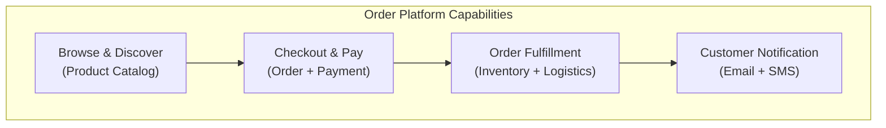

# Stakeholder View Visualizer — Examples

Use this reference when generating audience-specific architecture views from a shared model.

## Architect use cases

| Audience | Question they care about | Preferred view | Detail level |
| --- | --- | --- | --- |
| Business / Product | What can the system do, and where is the user value? | Business capability map / System Context | Business capabilities, no implementation detail |
| Engineering leads | How is the system split into services, and who owns what? | Container view + ownership annotations | Services, databases, and teams |
| Developers | How does this module integrate, and what is the interface? | Component view / API boundary map | Interfaces, dependencies, and protocols |
| Platform / Ops | Where is it deployed, how is it released, and where is monitoring? | Deployment topology + release path | Environments, infrastructure, and monitoring |
| Security | How does data move, and where are trust boundaries? | Data-flow map + trust boundaries | PII paths, authentication points, and network isolation |
| Executive | What is the return on investment, and where are the risks? | Capability heatmap + risk summary | Business impact, cost, and risk |

## Viewpoint matrix example

```markdown
## Viewpoint Matrix: Order Platform

| Stakeholder | Decision to make | Diagram | Key nodes to show |
|-------------|-----------------|---------|-------------------|
| CPO | Should we invest in order-platform expansion? | Business capability map | Ordering, payment, and fulfillment capabilities |
| Platform lead | Are service boundaries reasonable? | Container view | Order/Billing/Inventory + interfaces |
| Order team | How should the team call the Inventory API? | Component + API boundary | Order-svc internals + gRPC interfaces |
| SRE | How should it be monitored, and what is the alert path? | Deployment topology + monitoring nodes | EKS pods + ALB + CloudWatch |
| Security | Which boundary contains PII data? | Data flow + trust boundaries | Customer PII -> Order DB |
```

## Business capability view (Mermaid)



## Quality rules

- A business view must not expose service names, database types, or protocols.
- A developer view must not hide critical interfaces or dependency directions.
- All views must come from the same shared model — never maintain separate facts per audience.
- Each view must answer exactly one decision question; if it answers two, split it.
- Attach a three-sentence explanation per view: what it shows, what it hides, and what action it enables.
