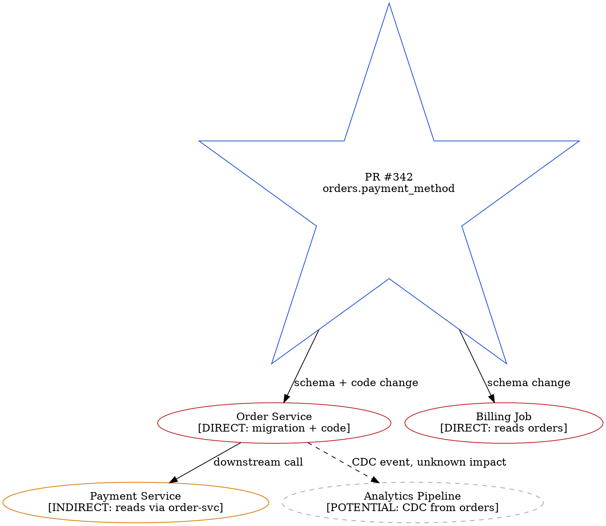

# Change Impact Visualizer — Examples

Use this reference when generating blast radius, impact maps, or release risk diagrams.

## Architect use cases

| Question | Prefer this format | Evidence to require |
| --- | --- | --- |
| Which services will this PR affect? | Change-impact graph (Graphviz) | git diff and service dependency graph |
| If an API interface changed, which consumers are affected? | Interface consumer map | OpenAPI spec and API client code |
| Which services are affected by a database schema change? | Data dependency map + schema diff | Migration files and ORM mappings |
| What regression test scope does this change require? | Impact x test matrix (Markdown) | Coverage reports and integration test directories |

## Impact layers (always produce all 5)

```markdown
## Impact Matrix: PR #342 — Add payment_method column to orders table

| Layer | Affected | Details | Risk |
|-------|----------|---------|------|
| Code | order-svc, billing-job | Schema change, migration required | High |
| API | GET /orders response shape | New field added (non-breaking) | Low |
| Data | orders table (50M rows) | ALTER TABLE + backfill required | High |
| Tests | order-svc integration tests | Fixtures need update | Medium |
| Deployment | order-svc, billing-job | Deploy order: migration → svc → job | High |
```

## Impact graph DOT snippet



## Release risk checklist template

```markdown
## Release Risk: PR #342

- [ ] Migration: `ALTER TABLE orders ADD COLUMN payment_method VARCHAR(50)`
- [ ] Backfill: set default for 50M existing rows — estimate 2h with batching
- [ ] Deploy order: run migration → deploy order-svc → deploy billing-job
- [ ] Rollback: migration is reversible (no NOT NULL constraint yet)
- [ ] Monitor: orders creation rate, billing job success rate, payment errors
- [ ] Notify: billing-job owner (finance-team) of deploy window
```

## Quality rules

- Distinguish "code changed" from "runtime behavior changed" — not all code changes affect behavior.
- API and data contract changes must be labeled separately with compatibility risk.
- "Unknown impact" is a valid label; don't promote it to "no impact."
- Always include: deployment order, rollback strategy, and monitoring signals.
