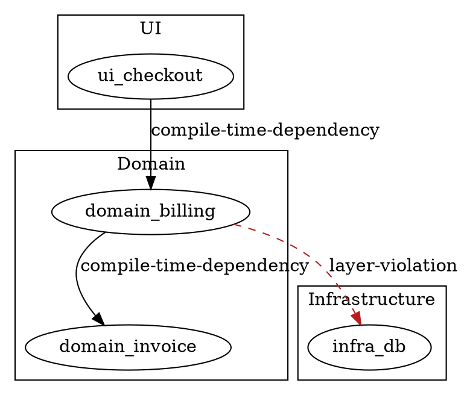

# Dependency Map Visualizer — Examples

Use this reference when generating module, package, or service dependency graphs.

## Architect use cases

| Question | Prefer this format | Evidence to require |
| --- | --- | --- |
| Which packages depend on each other? Are there cycles? | Graphviz digraph, clustered by package | package.json / build files |
| Which module is the central bottleneck with the highest fan-in? | In-degree ranking + highlighted central node | Static import analysis |
| Are there layer violations, such as UI depending on Infrastructure? | Layered clusters + red violation edges | Architecture rules docs + imports |
| Are there direct service dependencies that should not exist? | Service dependency graph + ownership annotations | Service catalog and API clients |

## Minimal evidence model (module dependency)

```json
{
  "name": "Billing Module Dependencies",
  "nodes": [
    { "id": "ui.checkout", "type": "module", "label": "checkout (UI)", "group": "ui", "confidence": "high", "sourceRefs": ["src/ui/checkout/index.ts"] },
    { "id": "domain.billing", "type": "module", "label": "billing (Domain)", "group": "domain", "confidence": "high", "sourceRefs": ["src/domain/billing/index.ts"] },
    { "id": "domain.invoice", "type": "module", "label": "invoice (Domain)", "group": "domain", "confidence": "high", "sourceRefs": ["src/domain/invoice/index.ts"] },
    { "id": "infra.db", "type": "module", "label": "db-adapter (Infra)", "group": "infra", "confidence": "high", "sourceRefs": ["src/infra/db/index.ts"] }
  ],
  "edges": [
    { "from": "ui.checkout", "to": "domain.billing", "type": "compile-time-dependency", "confidence": "high", "sourceRefs": ["src/ui/checkout/billingClient.ts"] },
    { "from": "domain.billing", "to": "domain.invoice", "type": "compile-time-dependency", "confidence": "high", "sourceRefs": ["src/domain/billing/invoicePort.ts"] },
    { "from": "domain.billing", "to": "infra.db", "type": "layer-violation", "description": "Domain imports infra directly", "confidence": "high", "sourceRefs": ["src/domain/billing/repository.ts"] }
  ]
}
```

## Artifact Delivery

Write `artifacts/billing-dependencies.dot` directly from the inspected evidence
and pair it with a Markdown evidence note. Use the target project's own
dependency tooling when it exists; otherwise keep the graph small enough to
audit manually.

## DOT snippet — layer violation highlighted



## Quality rules

- Always cluster by architectural layer or owner to make violations visible.
- Dashed + red for violation edges; solid for intended dependencies.
- Report cyclic dependencies separately; a cycle in domain code is always high risk.
- Keep the graph to one zoom level; for large repos, filter to one service or one layer at a time.
