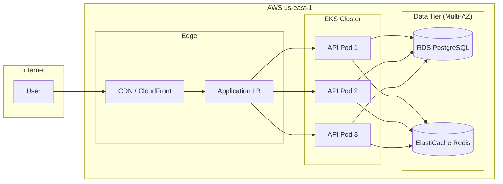

# Deployment Topology Visualizer — Examples

Use this reference when generating deployment, infrastructure, or runtime topology diagrams.

## Architect use cases

| Question | Prefer this format | Evidence to require |
| --- | --- | --- |
| Where is each service deployed? How many instances? Which environment? | Deployment topology (Graphviz or Mermaid) | Kubernetes YAML, Helm charts, and Terraform |
| What is the full traffic path from CDN to pod? | Network path map with LB/Ingress | Ingress configuration and service mesh rules |
| Which services are deployed across AZs/regions, and which are not? | Availability-zone layering map | Deployment inventory and cloud provider configuration |
| Which network zones contain databases and caches? | Network boundaries + storage nodes | VPC/subnet configuration and security groups |

## Minimal evidence model

```json
{
  "name": "Production Deployment Topology",
  "nodes": [
    { "id": "internet", "type": "external-system", "label": "Internet", "confidence": "high" },
    { "id": "cdn", "type": "cloud-resource", "label": "CDN (CloudFront)", "confidence": "high", "sourceRefs": ["infra/cloudfront.tf"] },
    { "id": "alb", "type": "cloud-resource", "label": "Application Load Balancer", "confidence": "high", "sourceRefs": ["infra/alb.tf"] },
    { "id": "api-pod", "type": "service", "label": "API Service (3 pods)", "description": "Kubernetes Deployment, 3 replicas", "confidence": "high", "sourceRefs": ["k8s/api-deployment.yaml"] },
    { "id": "rds", "type": "database", "label": "RDS PostgreSQL (Multi-AZ)", "confidence": "high", "sourceRefs": ["infra/rds.tf"] },
    { "id": "redis", "type": "database", "label": "ElastiCache Redis", "confidence": "high", "sourceRefs": ["infra/redis.tf"] }
  ],
  "edges": [
    { "from": "internet", "to": "cdn", "type": "calls", "protocol": "HTTPS", "confidence": "high" },
    { "from": "cdn", "to": "alb", "type": "calls", "protocol": "HTTPS", "confidence": "high" },
    { "from": "alb", "to": "api-pod", "type": "calls", "protocol": "HTTP", "confidence": "high" },
    { "from": "api-pod", "to": "rds", "type": "writes", "protocol": "SQL", "confidence": "high" },
    { "from": "api-pod", "to": "redis", "type": "reads", "protocol": "Redis", "confidence": "high" }
  ]
}
```

## Mermaid snippet



## Quality rules

- Label environments explicitly: production, staging, dev.
- Show replica counts when they affect reliability reasoning.
- Highlight single-AZ components as potential availability risks.
- Keep network boundary (VPC/subnet) visible on the diagram.
- Source every node from IaC or deployment manifest; never infer from service name alone.
