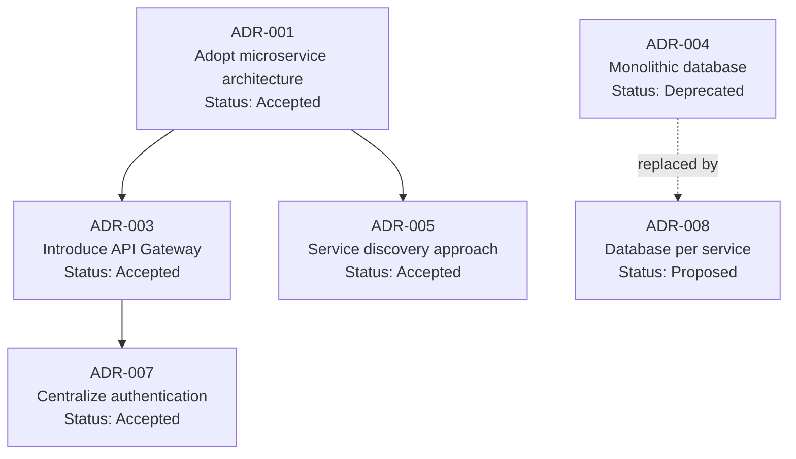

# Architecture Decision Visualizer — Examples

Use this reference when generating ADR timelines, decision trees, or tradeoff matrices.

## Architect use cases

| Question | Prefer this format | Evidence to require |
| --- | --- | --- |
| Why choose A instead of B? | Tradeoff matrix (Markdown table) | ADR docs, review notes, and constraints |
| Which key decisions were made historically, and in what order? | ADR timeline (Mermaid timeline or Markdown) | ADR IDs, dates, and statuses |
| Do these decisions depend on or conflict with each other? | Decision relationship graph (Mermaid graph) | ADR supersedes/relates-to fields |
| Are the assumptions behind a decision still valid? | Assumption validation checklist (Markdown) | Assumption list + validation signals |

## ADR tradeoff matrix example

Option comparison: message queue technology selection

| Evaluation dimension | Kafka | RabbitMQ | AWS SQS |
| --- | --- | --- | --- |
| Throughput | Very high (millions/sec) | Medium (tens of thousands/sec) | Medium (tens of thousands/sec) |
| Message retention | Configurable (days/weeks) | Deleted after consumption | 14-day limit |
| Operational complexity | High (requires Zookeeper/KRaft) | Medium | Low (managed service) |
| Ordering guarantee | Ordered within partition | Ordered within queue | Standard queues are unordered |
| Team familiarity | Low | High | Medium |
| Cost | High self-hosting cost | Medium self-hosting cost | Pay as you go |
| **Decision** | ❌ Defer | ❌ Retire | ✅ Select |

Decision rationale: the current team is small, throughput is not the bottleneck,
and operational cost plus team familiarity take priority.

## Decision relationship Mermaid diagram



## ADR timeline example

```markdown
## Architecture Decision Timeline

| Date | ADR | Title | Status | Trigger |
|------|-----|-------|--------|---------|
| 2022-03 | ADR-001 | Adopt microservice architecture | Accepted | Monolith scaling bottleneck |
| 2022-06 | ADR-003 | Introduce API Gateway | Accepted | More services made routing complex |
| 2023-01 | ADR-004 | Shared database | Deprecated | Replaced by ADR-008 |
| 2023-09 | ADR-007 | Centralized authentication | Accepted | Security and compliance requirement |
| 2024-02 | ADR-008 | Database per service | Proposed | Data coupling made releases difficult |
```

## Quality rules

- Every ADR must have a status: Proposed / Accepted / Deprecated / Superseded / Needs Review.
- Tradeoff matrices must compare the same dimensions across all candidates.
- Don't delete deprecated ADR context; future reviewers need the history.
- Mark assumptions with a validation trigger: "if X happens, revisit this decision."
