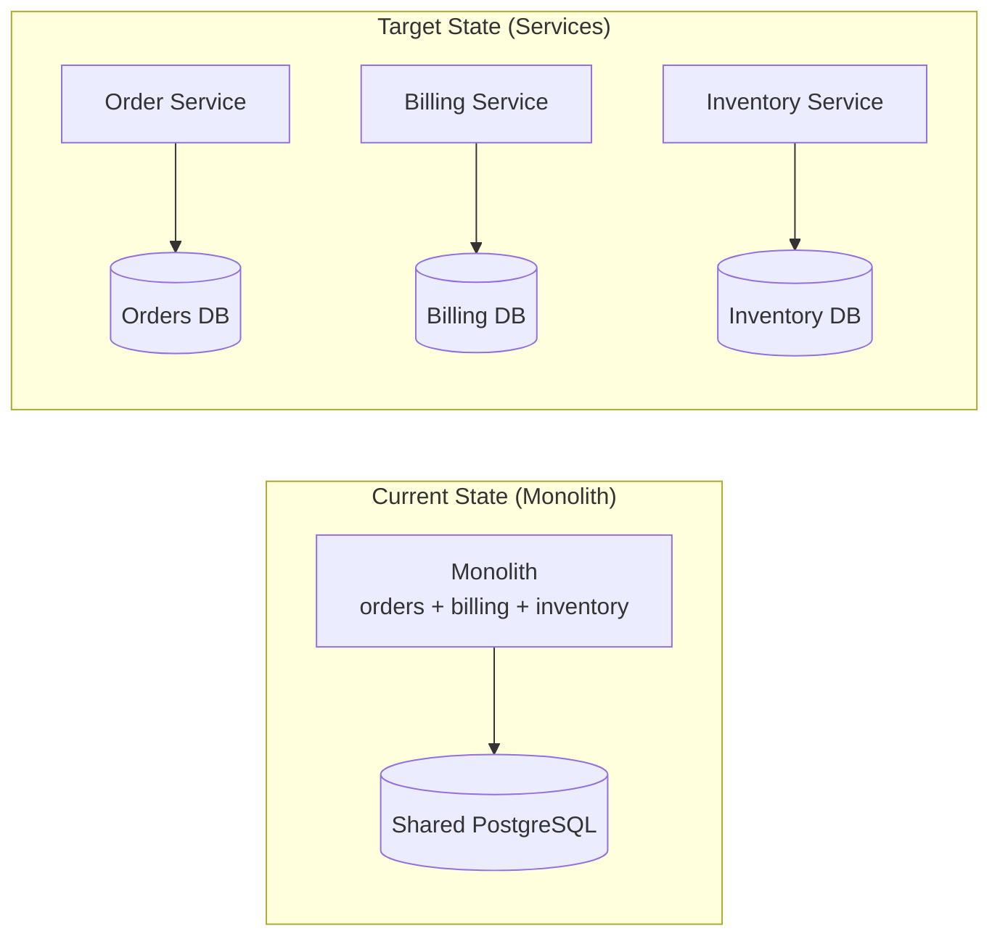
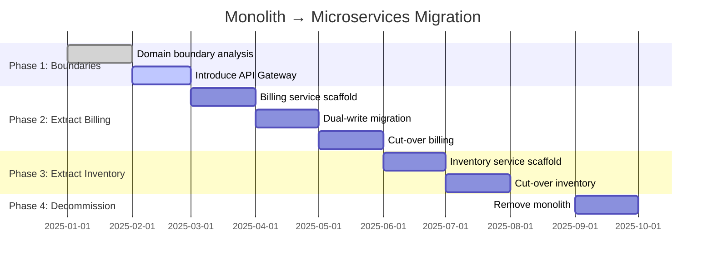

# Target State Gap Visualizer — Examples

Use this reference when generating current-vs-target architecture comparisons or migration roadmaps.

## Architect use cases

| Question | Prefer this format | Evidence to require |
| --- | --- | --- |
| How large is the gap between current and target state? | Side-by-side comparison (Mermaid or two C4 views) | Current-state map with code evidence + target-state design docs |
| How many migration phases are needed, and what happens in each phase? | Migration roadmap (Mermaid gantt or Markdown table) | Business constraints, team capacity, and technical dependencies |
| Which component is hardest to migrate, and why? | Blocker map (Graphviz) | Dependency map and data-coupling analysis |
| What are the acceptance criteria for each phase? | Phase checkpoint table (Markdown) | Business metrics, technical metrics, and release gates |

## Current vs target comparison (Mermaid)



## Gap map example

```markdown
## Gap Map: Monolith → Microservices

| Gap Type | Description | Complexity | Blocker? |
|----------|-------------|------------|----------|
| Structural gap | Billing and order logic are in the same codebase with no clear boundary | High | Yes |
| Data gap | Shared orders table, written by both billing and order logic | High | Yes |
| Platform gap | No service discovery and no API Gateway | Medium | Yes |
| Team gap | No dedicated billing team and no on-call ownership | Low | No |
| Operations gap | No independent deployment pipeline | Medium | No |
```

## Migration roadmap (Mermaid gantt)



## Quality rules

- Target-state nodes must be labeled as `state: proposed` or `state: target`; never present them as current facts.
- Every migration phase must have: deliverable, success metric, and rollback condition.
- Dual-write periods need explicit start and end dates — they're the highest-risk window.
- Data migration complexity (schema + volume + consistency) must be estimated separately from code complexity.
