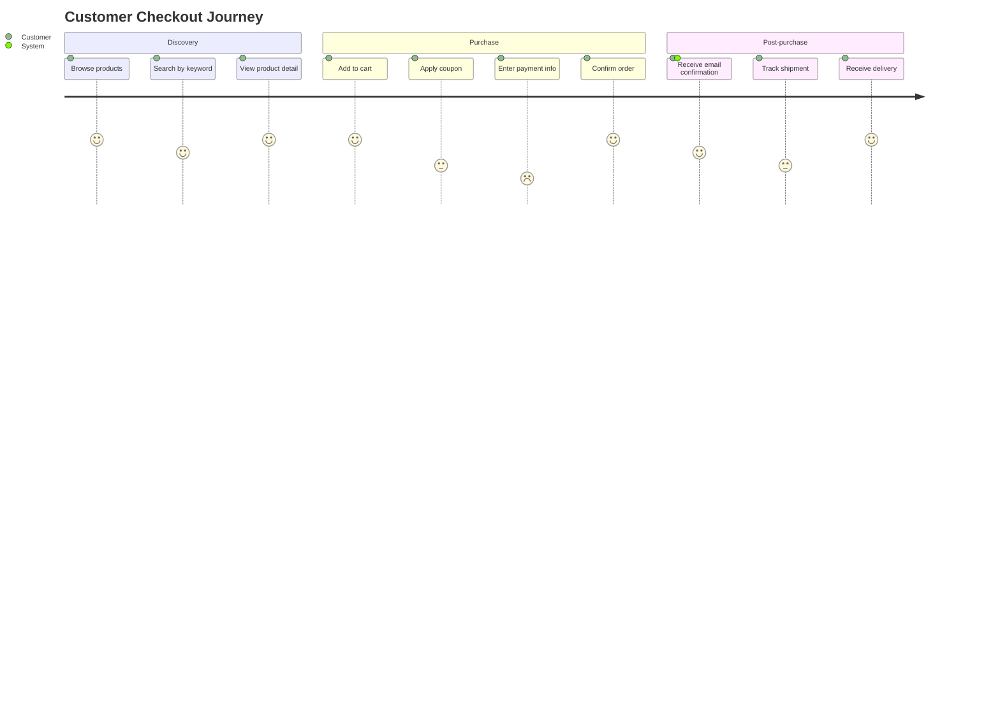
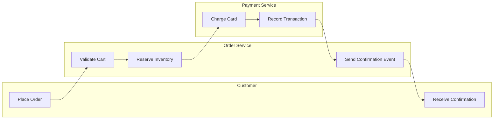

# Business Flow Visualizer — Examples

Use this reference when generating business process, user journey, or value stream diagrams.

## Architect use cases

| Question | Prefer this format | Evidence to require |
| --- | --- | --- |
| What is the complete user journey from signup to ordering? | User journey map (Mermaid journey) | UX docs, user stories, and operational data |
| Which steps and roles are involved in the end-to-end business process? | Swimlane diagram (Mermaid flowchart / PlantUML) | Business docs, process standards, and operations SOPs |
| Which value-stream step is slowest or has the most waste? | Value stream map | Kanban data, deployment frequency, and lead time |
| Where should business domain boundaries be drawn? | Domain boundary map (bounded context map) | DDD event-storming output and team topology |

## User journey (Mermaid)



## Swim-lane flow (Mermaid)



## Value stream metrics table

```markdown
## Value Stream: Feature to Production

| Stage | Duration (avg) | Wait time | % efficient |
|-------|---------------|-----------|-------------|
| Idea to design | 5 days | 3 days wait | 40% |
| Design to dev-ready | 3 days | 1 day wait | 67% |
| Development | 4 days | 0.5 day wait | 87% |
| Code review | 2 days | 1.5 days wait | 25% |
| QA / staging | 3 days | 2 days wait | 33% |
| Production deploy | 0.5 days | 0 wait | 100% |
| **Total** | **17.5 days** | **8 days wait** | **54%** |
```

## Quality rules

- Business flow diagrams must use business language, not service or API names.
- Every step should have an owner (role or team); ambiguous ownership is a finding.
- Value stream maps must include wait time, not just processing time.
- Don't add technical implementation detail to user journey diagrams — that belongs in a separate view.
