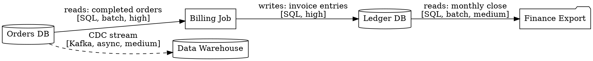

# Data Flow Visualizer — Examples

Use this reference when generating data lineage, data pipeline, or sensitive data path diagrams.

## Architect use cases

| Question | Prefer this format | Evidence to require |
| --- | --- | --- |
| Where does the data come from, where does it go, and what processing does it pass through? | Graphviz digraph (lineage) | ETL scripts, database schema, and pipeline configuration |
| Which services read or write the same database? | Data-store hub + read/write edges | ORM mappings, repository code, and migrations |
| Which nodes and boundaries does sensitive data (PII) cross? | Highlighted PII path + trust boundaries | Data classification docs and GDPR audit evidence |
| What is the full path from event producer to consumer? | Kafka/MQ flow map | Event schemas and consumer group configuration |

## Minimal evidence model

```json
{
  "name": "Order Data Lineage",
  "nodes": [
    { "id": "orders-db", "type": "database", "label": "Orders DB", "description": "PostgreSQL, stores order records", "confidence": "high", "sourceRefs": ["infra/postgres.tf"] },
    { "id": "billing-job", "type": "service", "label": "Billing Job", "description": "Nightly batch billing", "confidence": "high", "sourceRefs": ["jobs/billing/main.py"] },
    { "id": "ledger-db", "type": "database", "label": "Ledger DB", "description": "PostgreSQL, stores invoice records", "confidence": "high", "sourceRefs": ["infra/ledger.tf"] },
    { "id": "finance-export", "type": "service", "label": "Finance Export", "description": "Monthly CSV export to finance team", "confidence": "medium", "sourceRefs": ["jobs/finance-export/"] },
    { "id": "data-warehouse", "type": "database", "label": "Data Warehouse", "description": "BigQuery, analytics", "confidence": "high", "sourceRefs": ["infra/bigquery.tf"] }
  ],
  "edges": [
    { "from": "orders-db", "to": "billing-job", "type": "reads", "description": "Reads completed orders", "protocol": "SQL", "sync": "batch", "confidence": "high" },
    { "from": "billing-job", "to": "ledger-db", "type": "writes", "description": "Writes invoice entries", "protocol": "SQL", "confidence": "high" },
    { "from": "ledger-db", "to": "finance-export", "type": "reads", "description": "Reads for monthly close", "protocol": "SQL", "sync": "batch", "confidence": "medium" },
    { "from": "orders-db", "to": "data-warehouse", "type": "reads", "description": "CDC stream to analytics", "protocol": "Kafka CDC", "sync": "async", "confidence": "medium", "sourceRefs": ["infra/debezium.yaml"] }
  ]
}
```

## DOT snippet — data lineage

For Qoder Canvas or branch-heavy lineage maps, use `rankdir=TB`. For a short linear ETL/CDC chain delivered as SVG or Markdown support material, `rankdir=LR` is acceptable and often easier to read.



## Artifact Delivery

Write `artifacts/order-data-lineage.dot` directly from the inspected data-flow
evidence and pair it with a Markdown note that lists confirmed sources,
assumptions, and validation gaps.

## Quality rules

- Use cylinder shape for databases, box for processing jobs, folder for exports.
- Label every edge with: what data crosses, protocol, batch/stream, and confidence.
- Mark PII data paths with a distinct color or label (e.g., `[PII]`).
- Batch edges (nightly/monthly) should be dashed to distinguish from real-time flows.
