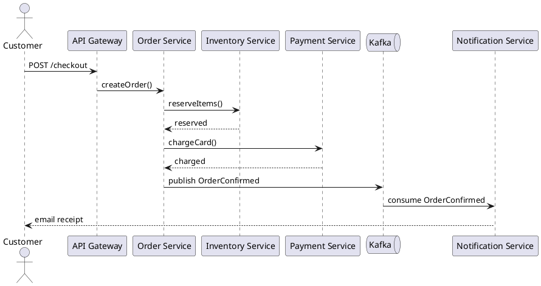

# Service Call Visualizer — Examples

Use this reference when generating service-to-service call graphs or sequence diagrams.

## Architect use cases

| Question | Prefer this format | Evidence to require |
| --- | --- | --- |
| Which services call each other? Are the calls synchronous or asynchronous? | Graphviz digraph or Mermaid flowchart | API clients and event consumer code |
| Which services does a critical user flow cross? | PlantUML sequence diagram | Request traces and OpenTelemetry spans |
| Which service is a single point of failure on the only call path? | Highlighted critical path + in-degree analysis | Service catalog + call graph |
| Are there direct calls that should not exist, such as bypassing the API gateway? | Call graph + boundary annotations | Network policies and service mesh configuration |

## Minimal evidence model

```json
{
  "name": "Order Checkout Call Graph",
  "nodes": [
    { "id": "api-gw", "type": "service", "label": "API Gateway", "confidence": "high", "sourceRefs": ["infra/gateway.yaml"] },
    { "id": "order-svc", "type": "service", "label": "Order Service", "owner": "order-team", "confidence": "high", "sourceRefs": ["services/order/"] },
    { "id": "inventory-svc", "type": "service", "label": "Inventory Service", "owner": "catalog-team", "confidence": "high", "sourceRefs": ["services/inventory/"] },
    { "id": "payment-svc", "type": "service", "label": "Payment Service", "owner": "finance-team", "confidence": "high", "sourceRefs": ["services/payment/"] },
    { "id": "notification-svc", "type": "service", "label": "Notification Service", "owner": "platform-team", "confidence": "medium", "sourceRefs": ["services/notification/"] }
  ],
  "edges": [
    { "from": "api-gw", "to": "order-svc", "type": "calls", "protocol": "HTTP", "sync": "sync", "confidence": "high" },
    { "from": "order-svc", "to": "inventory-svc", "type": "calls", "protocol": "gRPC", "sync": "sync", "confidence": "high", "sourceRefs": ["services/order/inventoryClient.ts"] },
    { "from": "order-svc", "to": "payment-svc", "type": "calls", "protocol": "HTTP", "sync": "sync", "confidence": "high", "sourceRefs": ["services/order/paymentAdapter.ts"] },
    { "from": "order-svc", "to": "notification-svc", "type": "publishes", "protocol": "Kafka", "sync": "async", "confidence": "medium", "sourceRefs": ["services/order/events.ts"] }
  ]
}
```

## Sequence diagram snippet (PlantUML)



## Quality rules

- Distinguish sync (solid arrow) from async (dashed arrow) relationships.
- Mark edges with low confidence as dashed and grey.
- Don't infer runtime calls from static imports alone; require trace data or integration test evidence.
- For large call graphs (> 15 services), filter to the critical path first.
