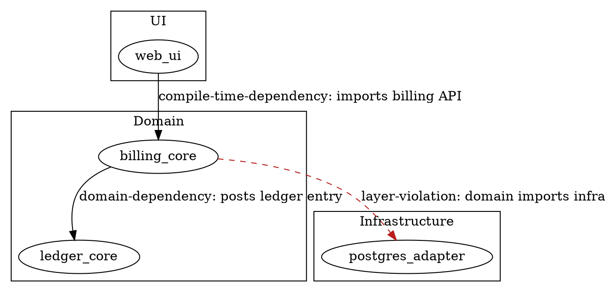
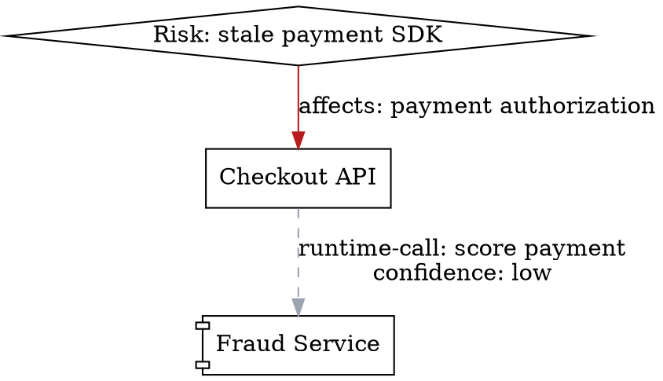

# Graphviz Scenarios

Use this reference when an architecture relationship map is relation-dense, non-C4, or needs filtering/layout guidance.

## Official anchors

- Graphviz `dot` is appropriate for directed, hierarchical or layered graphs, and tries to orient edges consistently while reducing crossings. See https://graphviz.org/docs/layouts/dot/.
- DOT supports directed `digraph` edges with `->`, quoted identifiers, attributes, subgraphs, and comments. See https://graphviz.org/doc/info/lang.html.
- Clustered layouts are encoded as subgraphs named with the `cluster` prefix, useful for showing separate rectangular layout regions. See https://graphviz.org/Gallery/directed/cluster.html.

## Architect use cases

| Scenario | Use Graphviz for | Avoid claiming |
| --- | --- | --- |
| Package/module dependency map | compile-time imports, cycles, layer violations, ownership boundaries | runtime calls unless traces/config prove them |
| Service call map | direct API calls, queues, batch jobs, unknown links needing validation | complete runtime topology from static imports only |
| Data lineage | reads/writes, jobs, stores, event streams, sensitive data hops | business ownership without evidence |
| Change impact | blast radius from a touched module/service/table | priority/severity unless risk evidence exists |
| Risk/tech-debt map | risk nodes connected to affected services and source refs | architectural fact when the edge is a human assumption |
| State machine/process graph | finite states, transitions, orchestration branches | C4 structure or ownership boundaries |

## Dependency map model

```json
{
  "name": "Billing Dependency Map",
  "nodes": [
    {
      "id": "web-ui",
      "type": "module",
      "label": "web-ui",
      "group": "frontend",
      "confidence": "high",
      "sourceRefs": ["apps/web/src/index.ts"]
    },
    {
      "id": "billing-core",
      "type": "module",
      "label": "billing-core",
      "group": "domain",
      "confidence": "high",
      "sourceRefs": ["packages/billing/src/index.ts"]
    },
    {
      "id": "legacy-tax",
      "type": "external-system",
      "label": "legacy-tax",
      "group": "external",
      "confidence": "unknown",
      "sourceRefs": ["docs/tax.md"]
    }
  ],
  "edges": [
    {
      "id": "web-billing",
      "from": "web-ui",
      "to": "billing-core",
      "type": "compile-time-dependency",
      "description": "Imports billing client",
      "confidence": "high",
      "sourceRefs": ["apps/web/src/billing.ts"]
    },
    {
      "id": "billing-tax",
      "from": "billing-core",
      "to": "legacy-tax",
      "type": "unknown-runtime-call",
      "description": "May call tax lookup before invoicing",
      "confidence": "low",
      "sourceRefs": ["docs/tax.md"]
    }
  ]
}
```

Artifact:

```text
artifacts/billing-dependencies.dot
```

Expected DOT characteristics:

- `digraph` with stable quoted node ids.
- `rankdir=TB` by default for Qoder Canvas and `.dot` preview compatibility.
- `rankdir=LR` only for small linear data lineage, traffic path, service path, or sequence-like graphs that are not expected to open first in Canvas.
- `subgraph cluster_*` when `--cluster-by` is used.
- Edge labels include relationship type, description, confidence, and source ref count.
- Low/unknown confidence edges are dashed and grey.

## Scenario snippets

Layer violation:



Data lineage:

This short lineage example uses horizontal flow for readability. Switch it to `rankdir=TB` when generating Qoder Canvas output or when the lineage branches into a dense graph.

```dot
digraph DataLineage {
  rankdir=LR;
  orders_db [shape=cylinder, label="Orders DB"];
  billing_job [shape=box, label="Billing Job"];
  ledger_db [shape=cylinder, label="Ledger DB"];
  finance_export [shape=folder, label="Finance Export"];

  orders_db -> billing_job [label="reads: order lines"];
  billing_job -> ledger_db [label="writes: invoice entries"];
  ledger_db -> finance_export [label="batch-export: monthly close"];
}
```



Risk/tech-debt graph:



## Quality rules

- Filter before rendering when the model has too many nodes. Prefer `--cluster-by owner`, `--cluster-by group`, `--cluster-by type`, or a smaller evidence model.
- Use Graphviz for relationship density, not C4 semantics. If the user needs system context/container/component consistency, route to `c4model`.
- Preserve edge type distinctions; static import, runtime call, data access, event publish/subscribe, deployment relationship, and human assumption are different facts.
- Pair the DOT with a short summary that names the filter, top clusters, surprising edges, low-confidence edges, and next validation task.
- Run `npm run validate:examples` after changing examples or viewer resources.
