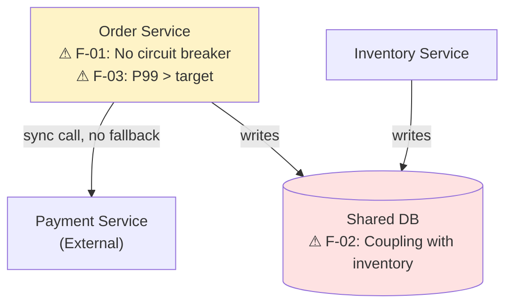

# Architecture Review Visualizer — Examples

Use this reference when generating architecture review diagrams, finding maps, or review report views.

## Architect use cases

| Review type | Preferred output | Evidence to require |
| --- | --- | --- |
| Review before launching a new system | Review map (System Context + Container + risk checklist) | Design docs, initial code, and deployment plan |
| Periodic review of an existing system | Current-state map + quality-attribute gaps + technical-debt heatmap | Monitoring data, incident history, and code metrics |
| Architecture change review (ADR) | Change-impact map + tradeoff matrix | PR diff, dependency graph, and interface changes |
| Cross-team interface alignment | Interface boundary map + consumer map | OpenAPI spec and API usage data |

## Review checklist template

```markdown
## Architecture Review: Order Service v2.0

### 1. System Context
- [ ] All external dependencies are identified and evidenced with high confidence.
- [ ] System boundaries and owners are explicit.
- [ ] Fallback strategies exist for external system failures.

### 2. Container / Service Design
- [ ] Services have single responsibilities and clear boundaries.
- [ ] There is no direct cross-service database access.
- [ ] Interfaces have a versioning strategy.

### 3. Data
- [ ] Data ownership is explicit, with only one service writing each table.
- [ ] PII data flows are identified and have encryption plus access control.
- [ ] Database changes have rollback plans.

### 4. Deployment & Operations
- [ ] Deployment pipelines exist and include automated tests.
- [ ] Monitoring and alerts cover key indicators.
- [ ] Progressive/canary release strategy exists.

### 5. Non-functional requirements
- [ ] Performance indicators have baselines and targets (P99 < X ms).
- [ ] Availability goals have SLO definitions.
- [ ] Security scans have passed with no critical CVEs.

### Findings
| ID | Severity | Finding | Owner | Due |
|----|----------|---------|-------|-----|
| F-01 | Critical | No circuit breaker on payment call | order-team | 2025-07-01 |
| F-02 | High | Shared DB with inventory-svc | infra-team | 2025-08-01 |
| F-03 | Medium | P99 exceeds target at peak | order-team | 2025-07-15 |
```

## Review view (Mermaid — findings mapped to nodes)



## Quality rules

- Every finding must have: severity (Critical/High/Medium/Low), description, owner, and due date.
- Attach findings to specific nodes/edges on the diagram, not just a separate list.
- Distinguish "must fix before launch" from "should fix this quarter" from "track and monitor."
- An architecture review without evidence-backed findings is just an opinion document.
