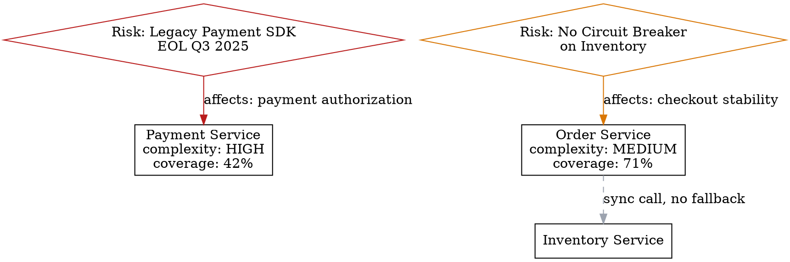

# Risk and Tech Debt Visualizer — Examples

Use this reference when generating risk heatmaps, tech debt maps, or governance roadmaps.

## Architect use cases

| Question | Prefer this format | Evidence to require |
| --- | --- | --- |
| Which modules are riskiest? Impact x probability matrix | Risk heatmap (Mermaid quadrant or Markdown matrix) | Incident records, complexity metrics, and change frequency |
| Which modules concentrate the most technical debt? | Module-level debt map (Graphviz) | Code complexity, test coverage, and outdated dependencies |
| Do external dependencies have security vulnerabilities or maintenance risk? | Dependency risk graph | `npm audit`, `pip-audit`, and CVE databases |
| Which risks should enter next quarter's backlog? | Risk register (Markdown table) | Risk score, remediation cost, and business impact |

## Risk register example

```markdown
| Risk ID | Area | Description | Probability | Impact | Score | Evidence | Owner | Action |
|---------|------|-------------|-------------|--------|-------|----------|-------|--------|
| R-001 | payment-svc | Legacy payment SDK EOL in Q3 | High | Critical | 9 | docs/sdk-eol.md | finance-team | Replace SDK before Q3 |
| R-002 | order-svc | No circuit breaker on inventory calls | Medium | High | 6 | incident-2024-11.md | order-team | Add Resilience4J |
| R-003 | analytics | No test coverage on billing aggregation | High | Medium | 6 | coverage-report.xml | platform-team | Add integration tests |
| R-004 | web-ui | React 17 → 19 migration pending | Low | Low | 1 | package.json | frontend-team | Monitor, plan for H2 |
```

## Tech debt DOT snippet



## Artifact Delivery

Write `artifacts/risk-map.dot` directly from the reviewed evidence and pair it
with a prioritized Markdown risk register.

## Quality rules

- Every risk score must show its calculation (probability × impact, not just a color).
- Separate "impacts delivery speed", "impacts stability", "impacts security", and "impacts cost".
- Tech debt map should distinguish: complexity (cyclomatic), coupling (afferent/efferent), test gap, and dependency age.
- Don't mark everything as critical; the goal is a prioritized, actionable list.
