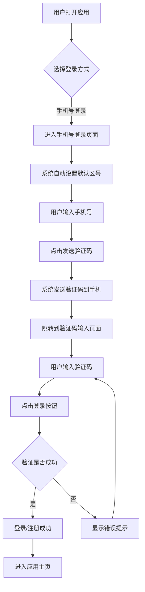
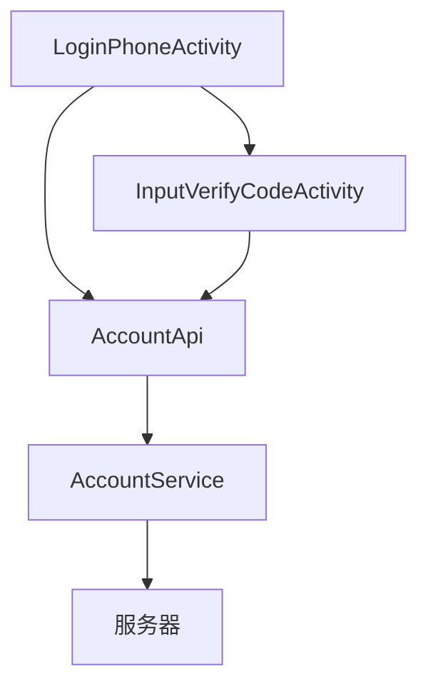

# reverse-doc-skill

## 1. Skill Overview

**reverse-doc-skill** 是一个用于从现有代码仓库中，自动逆向分析系统逻辑，并直接输出「产品文档 + 技术文档」的技能。

该 Skill 适用于：
- 历史项目
- 缺乏文档的代码仓库
- 接手他人项目 / 外包项目
- AI 需要“自己读代码”而不是被喂上下文的场景
- 需要快速了解项目核心功能的场景
- 项目文档更新与维护

---

## 2. Design Principles

### 2.1 Zero-Instruction Code Discovery

- 不依赖用户提供目录结构
- 不依赖用户指出具体文件
- AI 必须自行扫描、判断、归纳
- 支持多语言代码仓库的分析

### 2.2 Code as Source of Truth

- 代码是唯一可信信息源
- 文档内容必须可从代码逻辑中推导
- 禁止脑补不存在的功能
- 所有结论必须有代码依据
- **严格禁止捏造数据**：任何数据、链接、功能描述都必须基于实际代码
- **真实准确**：确保文档内容与代码实现完全一致，无任何虚构内容

### 2.3 One-Shot Output

- 不向用户暴露中间分析过程
- 不输出「我正在分析……」
- 直接给最终可用文档
- 文档结构清晰，内容完整

### 2.4 Context-Aware Analysis

- 基于代码上下文进行分析，理解组件间的依赖关系
- 识别核心业务逻辑和辅助功能
- 区分不同层级的代码（UI、业务逻辑、数据层）

---

## 3. What This Skill Produces

默认输出 **两类文档**：

### 3.1 产品文档（Product Doc）

- 产品定位
- 核心功能模块
- 目标用户
- 用户场景
- 用户流程（如登录 / 注册 / 核心路径）
- 界面设计概览
- 功能细节
- 交互设计
- 关键业务规则
- 异常与边界行为（如失败处理）
- 安全考虑
- 性能要求
- 测试要点

### 3.2 技术文档（Tech Doc）

- 技术架构概述
- 技术栈
- 核心组件设计
- 核心功能实现
- API 接口设计
- 数据结构设计
- 业务逻辑流程
- 安全性设计
- 性能优化策略
- 兼容性与适配
- 测试策略
- 部署与集成
- 监控与维护
- 代码优化建议

---

## 4. Usage

用户只需一句自然语言，例如：

> 请你查看当前项目代码，梳理登录流程，输出产品文档和技术文档。
> 请分析项目中的支付功能，生成完整的产品和技术文档。
> 请对整个项目进行逆向分析，输出产品文档和技术文档。

Skill 会自动完成：
1. 代码扫描：遍历项目目录，识别关键文件和模块
2. 关键路径识别：分析代码结构，识别核心功能和业务流程
3. 逻辑逆向：从代码中推导业务逻辑、用户流程和技术实现
4. 文档生成：根据分析结果，生成结构化的产品文档和技术文档
5. 文档输出：将生成的文档保存到指定位置

---

## 5. Output Rules

- 输出语言：**中文**
- 风格：结构化、偏工程文档
- 不出现分析过程
- 不出现“猜测”“可能”等不确定措辞
- 若代码中未体现，则明确标注“代码中未体现”
- 文档内容必须基于实际代码实现
- 提供详细的代码引用和路径
- 使用表格、流程图等可视化元素增强文档可读性
- 文档结构清晰，层次分明
- **严格禁止捏造数据**：
  - 禁止虚构功能、API、流程
  - 禁止伪造链接、地址、配置信息
  - 禁止凭空创造代码不存在的逻辑
  - 所有内容必须有代码依据
- **真实性验证**：
  - 对文档中的每个功能点进行代码验证
  - 确保参考资料链接真实有效
  - 检查文档与代码的一致性

---

## 6. Non-Goals

- 不做代码重构建议（除非用户额外要求）
- 不补齐缺失业务逻辑
- 不推断外部系统行为（除非有明确接口）
- 不修改现有代码
- 不执行构建或测试命令

---

## 7. Typical Use Cases

- 新人接手老项目：快速了解项目结构和核心功能
- 技术尽调：评估项目质量和技术风险
- 产品还原：从代码中恢复产品设计意图
- 自动补文档流程：为缺乏文档的项目生成规范文档
- 功能分析：深入分析特定功能的实现逻辑
- 代码审计：识别代码中的潜在问题和优化空间

---

## 8. Output Format

### 8.1 文档存储结构

生成的文档默认存储在项目根目录的 `doc` 文件夹中：

```
project_root/
└── doc/
    ├── product/          # 产品文档
    │   └── {feature}_product_document.md
    └── tech/             # 技术文档
        └── {feature}_technical_document.md
```

### 8.2 文档命名规范

- 产品文档：`{功能名称}_product_document.md`
- 技术文档：`{功能名称}_technical_document.md`

### 8.3 文档内容要求

- 产品文档：面向产品、设计和业务人员，关注用户体验和业务逻辑
- 技术文档：面向开发人员，关注技术实现和代码细节
- 两者都必须基于实际代码，确保内容的准确性和可验证性

---

## 9. Example Output

以「手机号登录注册功能」为例，输出文档结构如下：

### 产品文档示例

```markdown
# 手机号登录注册功能产品文档

## 1. 功能概述

手机号登录注册是应用的核心认证方式之一，允许用户通过手机号码和验证码快速登录或注册账号。

## 2. 功能目标

- 提升用户注册转化率
- 支持全球化用户
- 保障账号安全
- 优化用户体验

## 3. 目标用户

- 新用户
- 老用户
- 国际用户

## 4. 用户场景

### 4.1 新用户注册
### 4.2 老用户登录
### 4.3 国际用户登录

## 5. 功能流程



## 6. 界面设计
## 7. 功能细节
## 8. 交互设计
## 9. 异常处理
## 10. 安全考虑
## 11. 性能要求
## 12. 测试要点
```

### 技术文档示例

```markdown
# 手机号登录注册功能技术文档

## 1. 技术架构概述

手机号登录注册功能基于Android平台开发，采用Kotlin语言实现，使用MVVM架构模式。

### 1.1 技术栈

| 技术/依赖 | 用途 | 版本要求 |
|-----------|------|----------|
| Kotlin | 主要开发语言 | 1.5+ |
| Android SDK | 应用开发框架 | 21+ |
| RxJava | 异步网络请求 | 2.2+ |
| Retrofit | 网络请求框架 | 2.9+ |

## 2. 核心组件设计

### 2.1 组件架构图



## 3. 核心功能实现
## 4. API接口设计
## 5. 数据结构设计
## 6. 业务逻辑流程
## 7. 安全性设计
## 8. 性能优化策略
## 9. 兼容性与适配
## 10. 测试策略
## 11. 部署与集成
## 12. 监控与维护
## 13. 代码优化建议
```

---

## 10. Implementation Details

### 10.1 Code Analysis Strategy

1. **Directory Scanning**：递归遍历项目目录，识别关键文件类型
2. **File Filtering**：根据文件扩展名和路径，过滤出相关代码文件
3. **Content Analysis**：分析文件内容，识别核心功能和业务逻辑
4. **Dependency Mapping**：分析组件间的依赖关系，构建功能图谱
5. **Pattern Recognition**：识别常见的设计模式和架构风格

### 10.2 Document Generation Process

1. **Template Selection**：根据功能类型，选择合适的文档模板
2. **Content Extraction**：从代码中提取关键信息和业务逻辑
3. **Structure Organization**：按照文档结构，组织提取的信息
4. **Visual Element Generation**：生成流程图、架构图等可视化元素
5. **Quality Assurance**：检查文档内容的准确性和完整性
6. **Document Output**：将生成的文档保存到指定位置

### 10.3 Supported Technologies

- **Programming Languages**：Java, Kotlin, Swift, Objective-C, JavaScript, TypeScript, Python, Go, PHP, Ruby
- **Frameworks**：Android, iOS, React, Vue, Angular, Spring, Django, Flask, Express
- **Architectures**：MVC, MVVM, MVP, Clean Architecture, Microservices

---

## 11. Limitations

- **Code Complexity**：对于高度复杂或混乱的代码，分析准确性可能降低
- **External Dependencies**：对于依赖外部服务或API的功能，只能分析集成部分
- **Dynamic Behavior**：对于运行时动态生成的行为，分析能力有限
- **Documentation Quality**：文档质量取决于代码的可读性和注释完整性
- **Performance**：对于大型代码库，分析和文档生成可能需要较长时间

---

## 12. Conclusion

**reverse-doc-skill** 是一个强大的工具，能够从现有代码仓库中自动逆向分析系统逻辑，并生成结构化的产品文档和技术文档。通过遵循「代码是唯一可信信息源」的原则，确保文档内容的准确性和可验证性。

该 Skill 不仅可以帮助开发人员快速了解陌生项目，还可以为历史项目补充缺失的文档，提高项目的可维护性和可理解性。